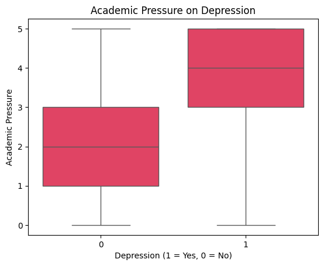
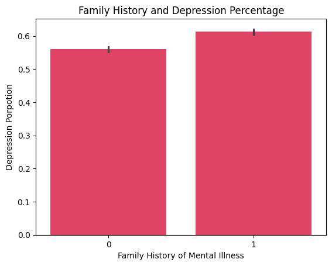
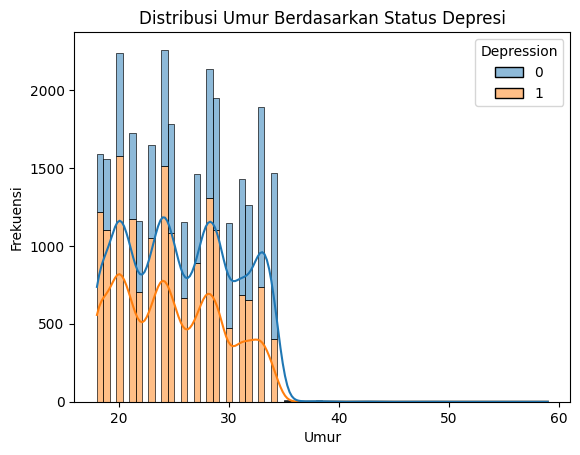
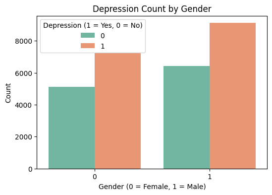
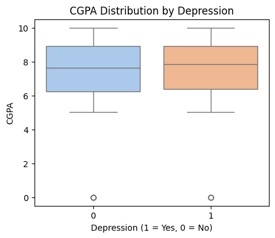
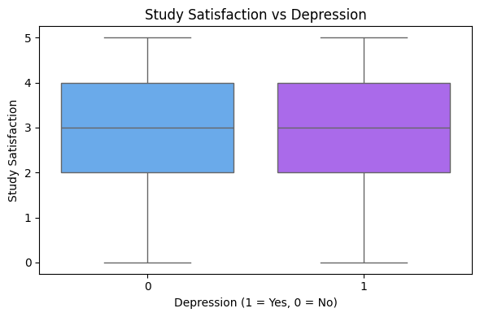
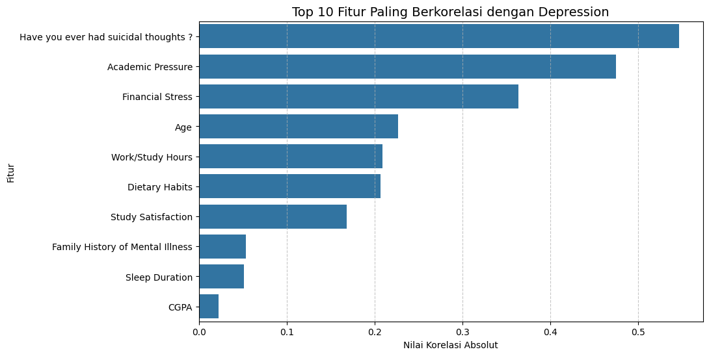

# Identifying the Real Causes of Student Depression: A Data-Driven Study

***What are the real drivers of student depression?*** In this project, I applied XGBoost and Random Forest to identify high-risk patterns among students. By analyzing 27,900 records, I moved beyond just making predictions to focus on interpretability. The goal is to highlight the specific lifestyle factors that lead to mental health struggles, making it easier to spot early warning signs and provide timely help.

---

## 📌 Quick Overview
This project analyzes 27,900 student records to identify the real drivers of depression using machine learning. By moving beyond simple prediction, this study highlights the "hidden" struggles of high-achieving students.

- Suicidal thoughts, academic pressure, and financial stress are the strongest predictors of depression.
- Depression does not correlate with academic performance; high-functioning students with top CGPA and high Study Satisfaction still face significant mental health risks.
- Age and gender show no significant variance, indicating that mental health issues are universal across the student population.
- Both XGBoost and Random Forest models achieved a consistent 84% accuracy, proving that situational and behavioral data are reliable for early detection.
---

## Table of Contents
1. [Dataset](#dataset)
2. [Data Preprocessing](#data-preprocessing)
3. [Exploratory Data Analysis (EDA)](#exploratory-data-analysis-eda)
4. [Model Development](#model-development)
5. [Results](#results)
6. [Conclusion](#conclusion)
7. [License](#license)
8. [Contact](#contact)

---

## Dataset 

The dataset used in this research was obtained from Kaggle: [Student Depression Dataset](https://www.kaggle.com/datasets/adilshamim8/student-depression-dataset)

- **Total Records**: 27,900
- **Attributes**: 18
- **Format**: Tabular data

| Column | Description |
| :--- | :--- |
| id | Unique identifier for each respondent |
| Gender | Respondent's gender (Male/Female) |
| Age | Respondent's age |
| City | City of residence |
| Profession | Current occupation or professional status |
| Academic Pressure | Level of academic pressure experienced |
| Work Pressure | Level of work-related pressure experienced |
| CGPA | Cumulative Grade Point Average |
| Study Satisfaction | Level of satisfaction with academic studies |
| Job Satisfaction | Level of satisfaction with job |
| Sleep Duration | Average sleep duration per day |
| Dietary Habits | Eating habits (Healthy / Moderate / Unhealthy) |
| Degree | Current or highest educational degree |
| Suicidal Thoughts | History of suicidal thoughts |
| Work/Study Hours | Daily working or study duration |
| Financial Stress | Level of stress caused by financial factors |
| Family History | Family history of mental health disorders |
| Depression | Depression indicator (target variable) |

---

## Data Preprocessing 

### 1. Missing Values and Duplicate Detection
I performed checks for null values and duplicates. No duplicate values were found, but several entries contained question marks ("?"). Fields containing question marks were replaced with NaN and removed from the dataset.

### 2. Data Mapping and Type Conversion 
Many features were in categorical format, so I performed mapping to convert the following attributes into numeric values for easier model processing:
- Gender
- Dietary Habits
- Sleep Duration
- Have you ever had suicidal thoughts?
- Financial Stress
- Family History of Mental Illness

### 3. Feature Selection
I removed attributes with object data types as they cannot be processed directly by the models. After cleaning, the dataset was reduced to **11 attributes**.

[⬆ Back to Top](#table-of-contents)

---

## Exploratory Data Analysis (EDA)
Through this analysis, I was able to obtain several insights from the dataset, as summarized below : 
### 1. Student Depression Distribution 

The dataset shows the distribution of students identified with depression versus those who are not. Understanding this balance is crucial for assessing model bias and ensuring the reliability of our classification results.

### 2. Academic Pressure vs. Depression

There is a clear positive correlation between academic pressure and depression risk. Students categorized as depressed exhibit a significantly higher median pressure score. This suggests that high academic load is a primary predictor for mental health struggles in this cohort.

### 3. Family History and Depression Percentage 

Data indicates that a family history of mental illness increases the prevalence of depression by approximately 5%. While not the sole determinant, it acts as a contributing risk factor, suggesting a genetic or environmental predisposition that the model should account fo

### 4. Age Distribution Based on Depression Status

Interestingly, both Age and Gender show a relatively uniform distribution across depressed and non-depressed groups. The lack of significant variance suggests that these demographic factors are not dominant drivers of depression within this specific dataset, shifting the focus toward behavioral and situational variables.

### 5. Depression Count by Gender

The number of students experiencing depression is higher than those who are not, in both male and female groups. The similar distribution pattern indicates that gender is not a dominant factor in depression rates in this dataset.

### 6. CGPA Distribution by Depression

Contrary to common assumptions, CGPA and Study Satisfaction scores are nearly identical for both groups. This finding is critical: it reveals that depression does not necessarily correlate with poor academic performance, highlighting the existence of "high-functioning" depression among students who maintain high grades while struggling mentally.

### 7. Study Satisfaction vs Depression

Surprisingly, the data reveals that Study Satisfaction does not show a clear difference between depressed and non-depressed students. Both groups report nearly identical satisfaction levels.This finding suggests a "hidden" struggle: a student can be satisfied with their major or studies and still experience high levels of depression. It proves that academic happiness alone is not a reliable indicator of a student's mental health status, as depression can exist even when a student feels positive about their academic choices.

### 8. Top 10 Features

The chart reveals that suicidal thoughts, academic pressure, and financial stress are the strongest predictors of depression, showing the highest correlation coefficients. While lifestyle factors like age and diet show moderate impact, academic performance (CGPA) and sleep duration have surprisingly low correlations, suggesting that emotional and external pressures are far more critical indicators of mental health in this dataset than grades or biological habits.

[⬆ Back to Top](#table-of-contents)
---

## Model Development

After exploring the data through EDA, I built two models: **Random Forest** and **XGBoost**. The dataset was split into 80% training and 20% testing to predict the Depression label (1 = Yes, 0 = No).

**Random Forest** was chosen as the baseline model because it is:
- Easy to implement
- Stable and effective in handling non-linear relationships between variables
- Provides feature importance rankings, helping identify which factors most influence student depression

**XGBoost** was selected as an advanced boosting algorithm with:
- Better generalization ability
- Built-in regularization to prevent overfitting
-High training efficiency
- Often produces more accurate predictions

---

## Results 

Both Random Forest and XGBoost models demonstrated nearly identical performance metrics, achieving approximately 84% accuracy, precision, recall, and F1-score. This indicates that both algorithms are equally effective in predicting student depression based on the given features.

| Model          | Accuracy | Precision | Recall | F1-Score |
|----------------|----------|-----------|--------|----------|
| Random Forest  | 0.837    | 0.84      | 0.84   | 0.84     |
| XGBoost        | 0.838    | 0.84      | 0.84   | 0.84     |

[⬆ Back to Top](#table-of-contents)

---

## Conclusion
This study demonstrates that student depression is primarily driven by psychological and external pressures rather than academic performance. Key insights include:
- Top Predictors: **Suicidal thoughts, academic pressure, and financial stress** are the most critical early warning signs identified by the models.
- The Data reveals that CGPA and Study Satisfaction do not correlate with depression, highlighting that high-performing students often mask their mental health struggles.
- Demographic factors like **Age and Gender showed no significant variance**, proving that depression is a widespread issue across the entire student population.
- Both XGBoost and Random Forest achieved a consistent 84% accuracy, confirming that behavioral and situational data are reliable for predicting mental health risks.

[⬆ Back to Top](#table-of-contents)
---

## License

This project is licensed under the MIT License.

---

## Contact

If you have any questions or feedback, feel free to reach out:
- **Email:** Ayusekar1822@gmail.com
- **LinkedIn:** https://www.linkedin.com/in/ayusekar22/
- **GitHub:** https://github.com/Ayusekar22

[⬆ Back to Top](#table-of-contents)