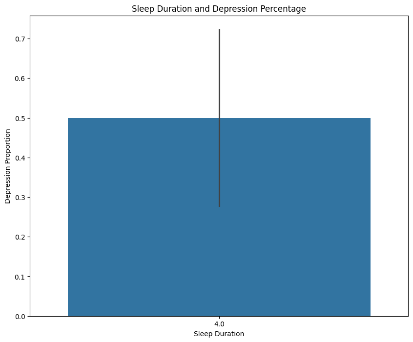

# Student Depression Prediction: A Comparison between XGBoost and Random Forest

## Description 

This project aims to identify whether students show a tendency toward depression based on lifestyle and demographic factors. By comparing two machine learning models XGBoost and Random Forest this study explores how these algorithms can detect patterns that may indicate the early stages of depression sehingga dapat membantu pelajar yang mengalami depresi seeks mental health?

## Dataset 
Dataset yang saya gunakan dalam penelitian ini berasal dari kaggle [https://www.kaggle.com/datasets/adilshamim8/student-depression-dataset] dengan total 27900 data dan 18 attributes dengan bentuk data berbentuk tabular

## Objectives 
1. Data Cleaning and Data Preprocessing
2. Performing Exploratory Data Analysis (EDA).
3. Data Modelling and Comparative Analysis of 2 models (XGBoost and Random Forest).
4. Evaluate model performance

## Tools & Libraries 
Python (Pandas, Numpy, Skcikit-learn, Seaborn, Matplotlib, XGBoost)

## Data Preprocessing 
1. Check Missing values and Duplicated Values.
Dalam hal ini saya melakukan pengecekan null values dan duplicated value. tidak ditemukan duplicated value namun ditemukan value yang berisi tanda tanya. Fieldnya yang berisi tanda tanya itu saya replace dengan nan lalu menghapusnya.
2. Data Mapping and data type conversion 
Dalam tahap ini saya melihat banyak data yang masih dalam bentuk kategori, jadi saya melakukan mapping untuk Gender, Dietary Habits, Sleep Duration, Have your ever had suicidal thoughts, Financial Stress, Family History of Mental Illness menjadi numeric agar memudahkan prediksi oleh model
3. Feature Selection
Disini saya membuang attributes dengan datatype object karena tidak dapat di proses oleh model. Setelah melakukan pembersihan, sekarang hanya terdapat 11 attributes
4. Train-Test Split : 80% for training, 20% testing. Untuk keperluan model 

## Exploratory Data Analysis (EDA)
1. Student Depression Distribution — overview of depression rates in the dataset.

2. Academic Pressure vs. Depression — identifying how academic stress influences depression levels.

3. Sleep Duration and Depression Percentage — analyzing rest patterns related to mental health.

4. Family History and Depression Percentage — understanding the relationship between family mental health history and depression tendency.

5. Age Distribution Based on Depression Status

6. Depression Count by Gender

7.CGPA Distribution by Depression

8. Study Satisfaction vs Depression

https://www.kaggle.com/datasets/adilshamim8/student-depression-dataset 

## Data Modelling

